# Decentralised Ecommerce Store

## Objective

To build a decentralised ecommerce store using Solidity and HTML/ CSS/ Javascript that emulates the following behaviours:

- **Owner/ Seller account** must be able to add new items to the ecommerce store
- **Buyer/ Consumer account** must be able to buy the listed items from the ecommerce store
- **Arbiter/ Contract account** must act as the central decision authority when issues pop up for refund/ release of amounts
- **Multi-Sig to ensure consensus** is arrived when issuing refund or release of funds to buyer/ seller
- The trade is managed by an **Escrow account** and upon consensys by 2/3 parties, the funds are either refunded to the buyer or released to the seller
- Store must have restrictions on the actions perfomed, which must be embedded to the Smart Contract
----------
## Technology Stack

- Smart Contract - Solidity
- Local Eth Network - Ganache
- Web UI - HTML/ CSS/ JS
- Decentralised Storage - IPFS
- Off-Chain data storage (Optional) - Mongo DB
----------
## Pre-requisites

- Execute `npm install` from the /app directory to install the web dependencies
- Truffle installation `npm install truffle -g`
- Ganache installation can be either CLI - `npm install ganache-cli -g` or [Ganache application](https://www.trufflesuite.com/ganache)
- [IPFS CLI or Desktop](https://ipfs.io/#install) must be installed for the decentralised storage to work
- [Mongo DB Community Server](https://www.mongodb.com/try/download/community) (Optional) must be installed for the Off-Chain data storage
----------
## Execution

- Start local Ganache network at **port 7545** (Modify this port config in `truffle-config.js`)
- Start IPFS by issuing the command `./ipfs daemon` from the extracted go-ipfs directory (if CLI version) or follow the instructions from the documentation for the desktop version
- Deploy the smart contract by issuing command `truffle compile && truffle migrate --reset` from the root directory
- Start the Web UI by issuing the command `npm run dev` from the app directory
-  Mongo DB Off-Chain data storage (Optional)
   - The code for the Off-Chain data storage is commented in the `index.js`
   - You could flip the methods `renderStore and renderProduct` in `index.js` and play with the on-chain and off-chain implementations
----------
### Testing

- **Prechecks**
  - Ganache
  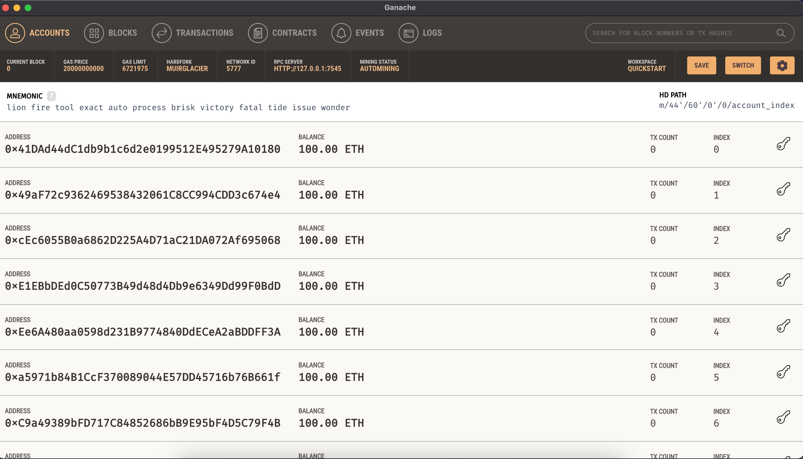
  - IPFS
  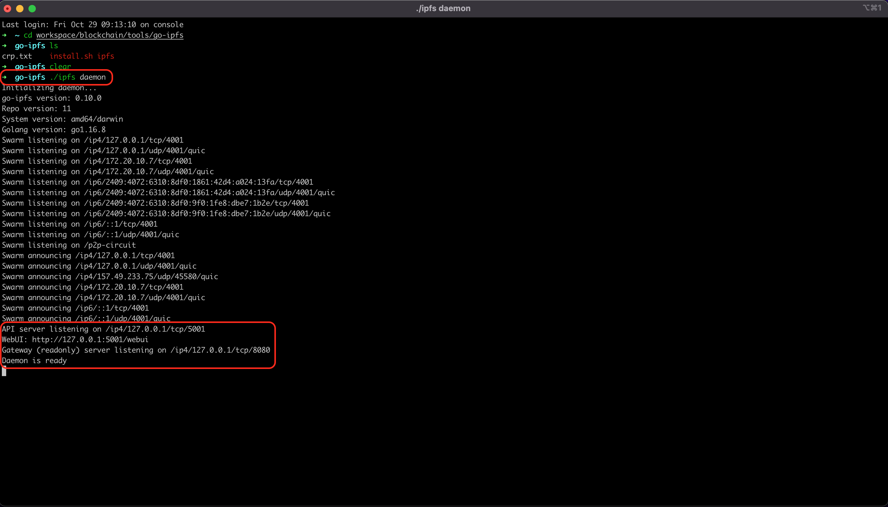
  - Smart-Contract
  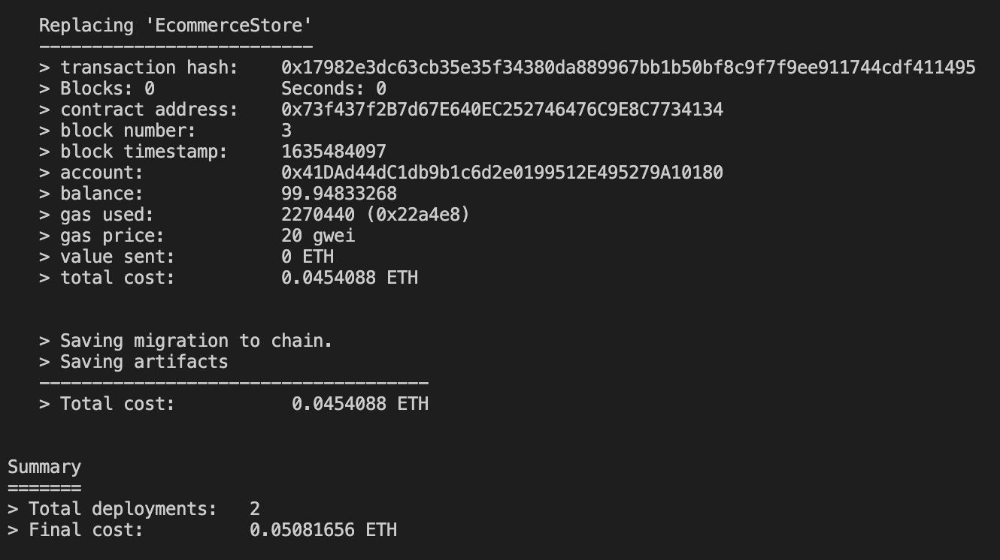
  - Web UI
  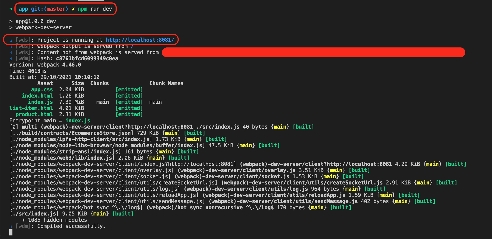

----------
- **Application Workflow**
  - Dashboard and Link Accounts on Metamask
  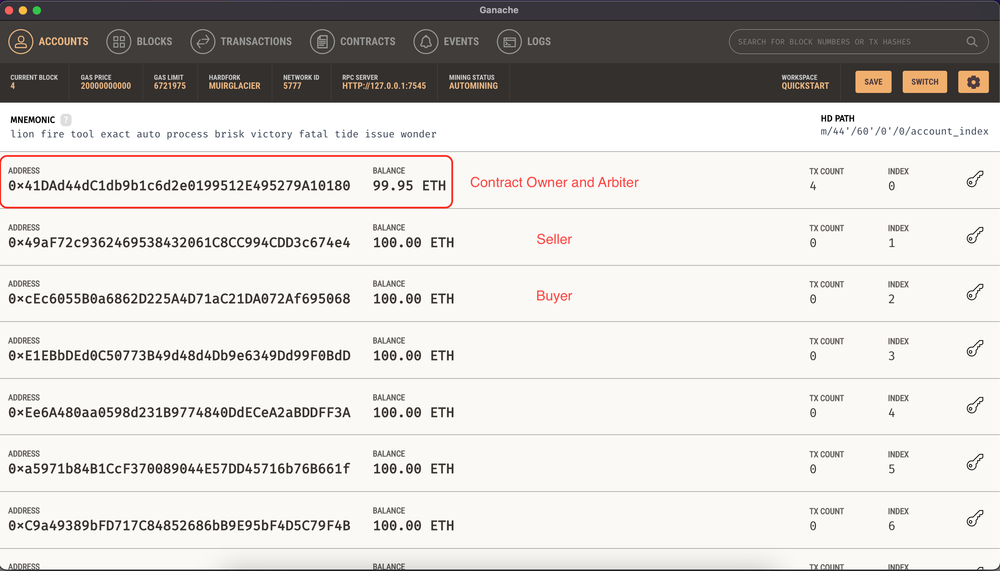
  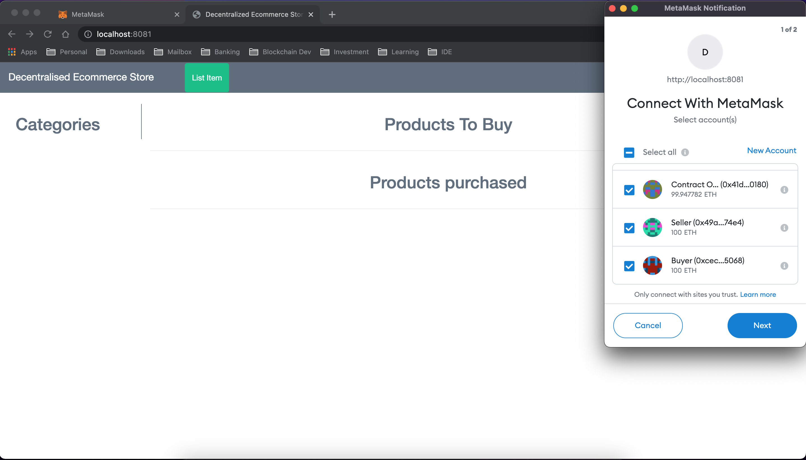
  - Switch to Seller Account in Metamask
  - Seller clicks List Item link to list a new item
  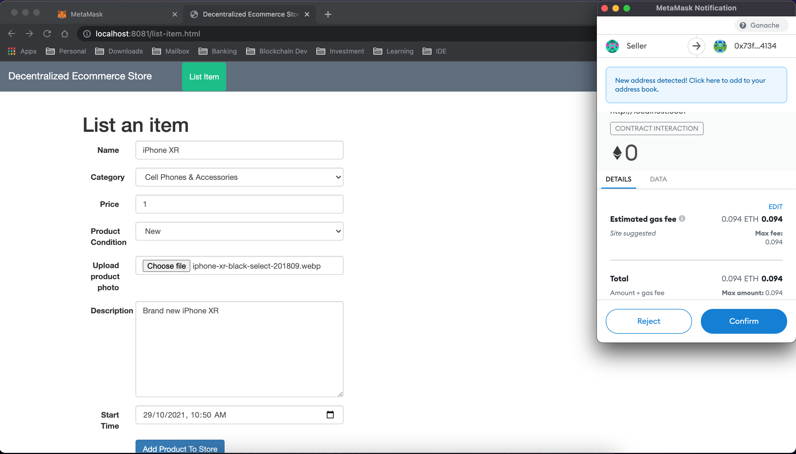
  - Listed New Item on Dashboard
  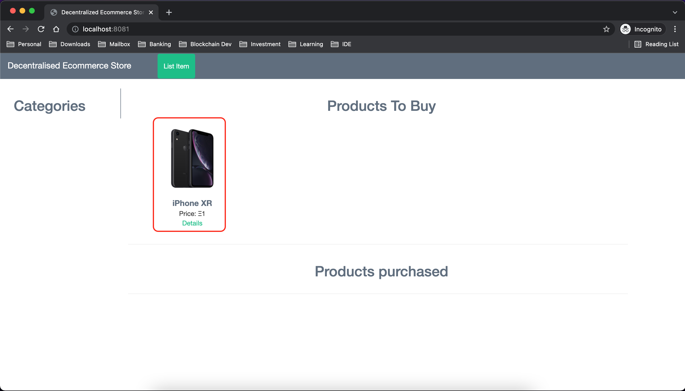
  - Switch to Buyer Account in Metamask
  - Buyer buys listed item
  
  - Purchased item on Dashboard
  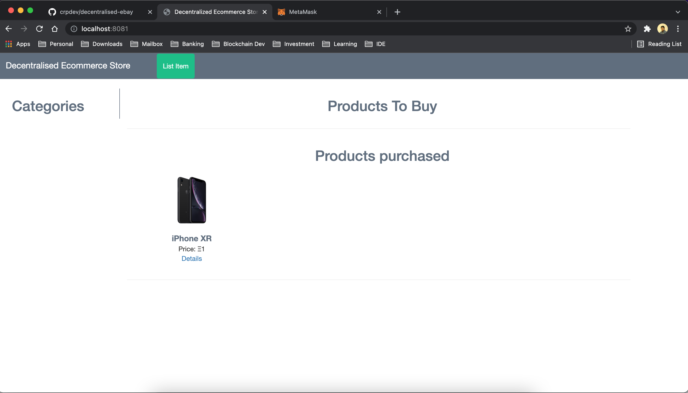
  - Arbiter and Buyer release funds to seller by clicking Details link
  - Buyer approves to release funds to seller
  
  - Arbiter approves to release funds to seller
  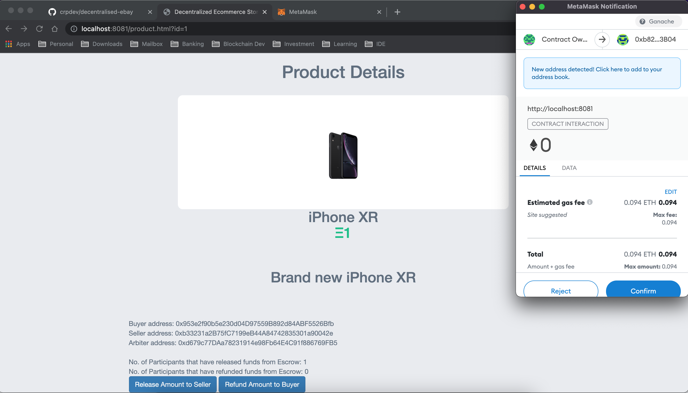
  - Final Account Balances
  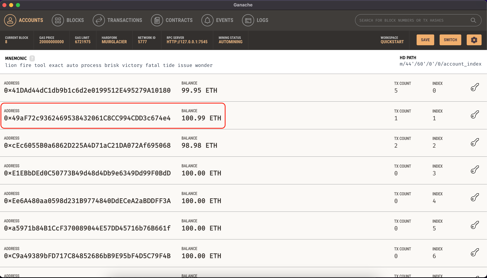
  ----------
  
  ## Queries/ Suggesstions?

  [Email](mailto:rajapandianc@outlook.in)
  [Twitter](https://twitter.com/crpcodes)
  [LinkedIn](https://www.linkedin.com/in/rajapandianc/)
  ----------
